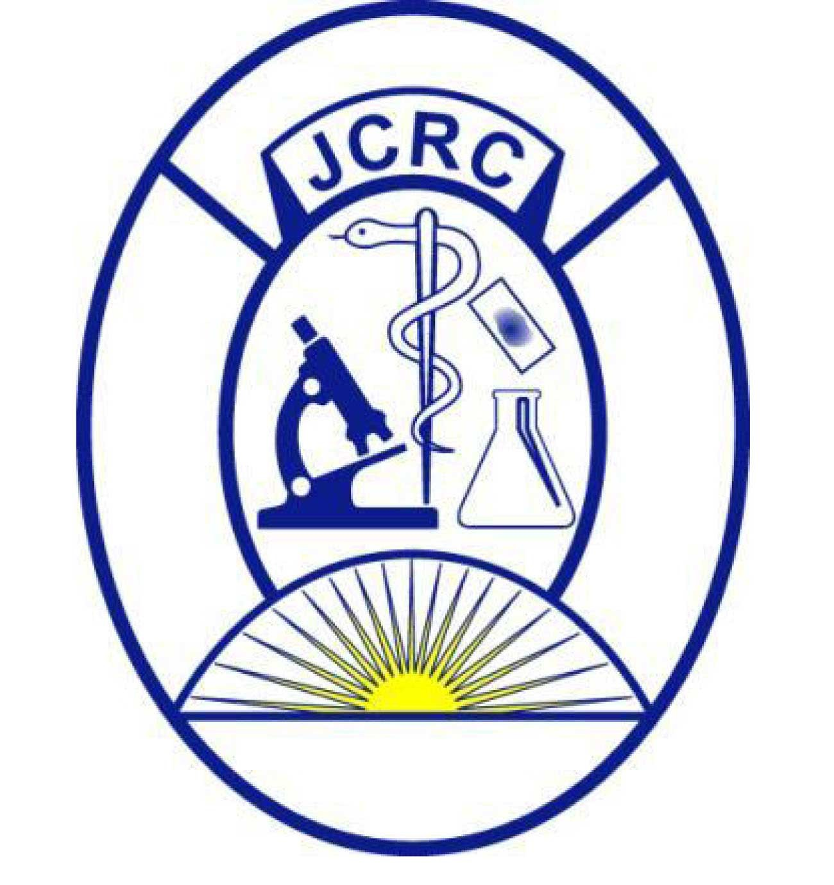

<p align="middle">`
 </p> <p align="middle">`

</p>

# Description

This is a repo for manipulating the Stanford HIV Json outputs to a Json format that can be interrogated by the LIMS to give a clinician only information that they need. 

This has been specifically tailored for JCRC. In case of any challenges or in need of a different format or any other kind of formatting, contact the developers whose contacts are in the contact section


## Installation

```
git clone https://github.com/Kanyerezi30/StanfordHIVJsonManipulation.git

bash StanfordHIVJsonManipulation/install.sh

source $HOME/.bashrc

```

## Usage

```
integrase <path of directory with integrase raw json files> <path of directory for formatted json to be output>

rtpr <path of directory with rtpr raw json files> <path of directory for formatted json to be output>

```

## Example

```
integrase $HOME/StanfordHIVJsonManipulation/test_dataset/IN_test.json $HOME/StanfordHIVJsonManipulation
rtpr $HOME/StanfordHIVJsonManipulation/test_dataset/Raw_RTPR.json $HOME/StanfordHIVJsonManipulation

```

The results will be found in StanfordHIVJsonManipulation

## Tested Platforms

The program has been tested on;
- Ubuntu 22.04 LTS


## To report bugs, ask questions or seek help

The software developing team works round the clock to ensure the bugs within the program are captured and fixed. For support or any inquiry: You can submit your query using the [Issue Tracker](https://github.com/Kanyerezi30/StanfordHIVJsonManipulation/issues)
